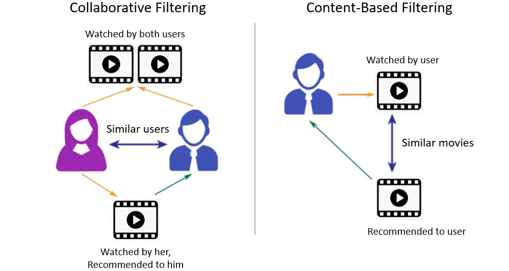

# Movie-Recommendation
This project is a movie recommendation system based on content-based filtering that uses Term Frequency-Inverse Document Frequency (TF-IDF) and cosine similarity approaches to deliver tailored movie recommendations.  The method uses textual metadata from movies, such as genres, narrative summaries, and keywords, to build TF-IDF vectors that indicate the value of each phrase in the movie descriptions.  By computing the cosine similarity between these vectors, the system quantifies movie similarity, allowing it to propose films that are closely connected to a user's interests.  This method successfully captures the semantic importance of content attributes, yielding accurate and personalized suggestions.  Experimental results show that the model is effective at increasing user happiness by recommending movies that closely match individual preferences.

The suggested method, which uses natural language processing and similarity assessment techniques, is a powerful tool for enhancing user experience on movie streaming services.

## Prerequisite Library

There are some needed Libraries for this project to work. They are 

- pandas
- sklearn
- difflib

> **Installation of pandas Library**
```bash
pip install pandas
```
> **Installation of scikit learn Library**
```bash
pip install -U scikit-learn
```
> **Installation of difflib Library**
```bash
pip install cydifflib
```


# Methodology



**This Project used Content -Base Filtering System.**


# Implementation
Following library are used for traing, testing and evaluating the overal projects:

```bash
## For data manupulation

panda

## For Model 
TfidfVectorizer
cosine_similarity

```

# Conclusion
This project focuses on content-based filtering using TF-IDF and conine smiliarty for recommendation. For the experiment, the user enters the movie name and desired numbers, after which a set number of movie names are presented.

**Choice of Movie:** Avangers

**Recommendation Number:** 5

| S.N | Movie Name | Similarity |
|----------|----------|----------|
| 1 | The Avengers | 1.00 |
| 2 | Avengers: Age of Ultron | 0.78 |
| 3 | Captain America: The Winter Soldier | 0.43|
| 4 |Captain America: Civil War | 0.4|
|5| Iron Man 2 | 0.39


